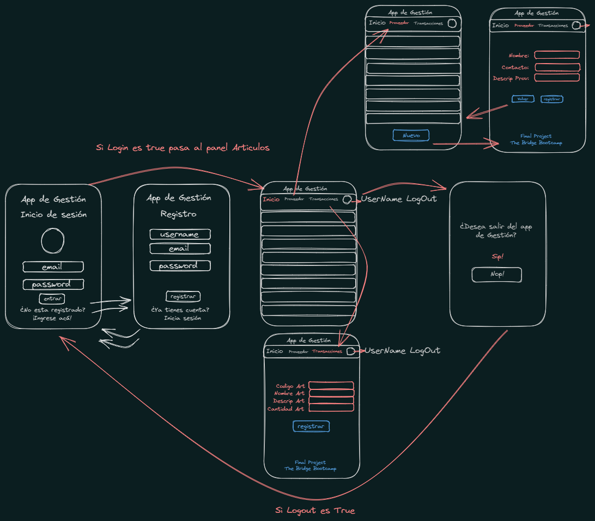

<h4 align="center">
:construction: Proyecto en construcción :construction:
</h4>

# Sistema de inventario de artículos

## Definición de cliente: :hammer: 🚀 👻

El usuario requiere de una aplicación donde deberá registrarse si no está registrado para acceder. Si no está registrado habrá un link que le lleve a un formulario de registro usando: correo, nombre de usuario y contraseña. En la vista de registro, deberá haber un link en caso que ya tenga un usuario registrado le redireccione a la pagina de Logín principal.

Se trata de una aplicación de control de inventarios de artículos, donde el cliente podrá llevar una gestión del stock de un determinado producto, identificado con codigo, descripción, cantidad en almacén.

Será necesario mostrar estos artículos ordenadamente identificados con su código respectivo, cantidad y descripción,
también en la pagina principal luego de logearse, deberá tener un botón del lado derecho para hacer LogOut y que al lado lleve el nombre del usuario logeado.

Nota: Podría crearse un modal, que al momento de hacer logout, consulte al usuario si está de acuerdo con salir de la aplicación o no.

## Definición técnica
### Backend: ✈🚀

Habría que tener aproximadamente 4 tablas para almacenar la información, que me permita hacer gestión del sistema de inventarios, las tablas especifico a continuación con sus columnas respectivas:

- Para Usuarios:
users
    id (uuid v4, PK),
    email,
    username,
    password


- Proveedores:
suppliers 
    id (uuid v4, PK),
    name_sup,
    contact_sup,
    desc_sup

- Productos:
products 
    id (uuid v4, PK),
    name_prod,
    desc_prod,
    quant_prod (integer),
    supplier_id UUID REFERENCES suppliers(id)

- Transacciones (Ingresos y salidas de articulos):
transactions
    id UUID PRIMARY KEY DEFAULT uuid_generate_v4(),
    date_trans DATE DEFAULT CURRENT_DATE,
    tipo_trans VARCHAR(10) NOT NULL,
    product_id UUID REFERENCES products(id),
    quant_trans INTEGER NOT NULL

----------------------------------------------------------------------------------------------
### endpoints autenticación

Los endpoints que necesitariamos para llevar a cabo el proyecto:

* Para Registrarse:
- POST /auth/signup
Recibirá un body como el siguiente:
```
{
  "user"     : "UserName",
  "email"    : "correos@domain.com",
  "password" : "* * * * * * * * * * *"
}
```

* Para logearse:
- POST /auth/signin
Recibirá un body como el siguiente:
```
{
  "email"    : "correos@domain.com",
  "password" : "* * * * * * * * * * *"
}
```
En caso que el usuario no exista o se haya equivocado de credenciales, mostrar un error (401)

Al validarse el usuario, se muestra el HomePage de la aplicación mostrando los articulos registrados si los hubiera

* Para Cerrar la sesión:
Creamos el siguiente endpoint:
```
- POST /auth/signout
```
--------------------------------------------------------------------------------------------
### endpoints Proveedores:
Creamos un endpoint inicial para mostrar aquellos que hayan sido registrados en el App:

* Muestra todos los proveedores registrados:
- GET /suppliers
```
Muestra todos los productos registrados
```

* Registra un nuevo proveedor:
- POST /suppliers/new
```
{
  "name_sup"     : "SupplierName",
  "contact_sup"  : "correo@domain.com",
  "desc_sup"     : "Potencial, poor, interesting, to evaluate..."
}
```


--------------------------------------------------------------------------------------------
### endpoints Productos:
Creamos un endpoint para mostrar los articulos:

* Muestra los articulos registrados:
- GET /products

```
Muestra todos los productos registrados
```

Tendriamos un endpoint para registrar los articulos:
* Para registrar articulos:
- POST /products/register
Recibirá un body como el siguiente:
```
{
  "name_prod"        : "ArticleN",
  "desc_prod"        : "lorem ipsum sempter blablabla",
  "quant_prod"       : "99",
  "name_sup_product" : "Proveedor_Existente"
}
```

Tendriamos un endpoint para editar los articulos si fuese necesario:
* Para editar articulos:
- PUT /products/:id
Recibirá un body como el siguiente:
```
{
  "name"        : "ArticleN",
  "description" : "lorem ipsum sempter blablabla",
  "quantity"    : "99",
}
```
Tendriamos un endpoint para eliminar los articulos si fuese necesario:
* Para eliminar articulos:
- DELETE /products/:id
Recibirá un body como el siguiente:
```
{
  "code" : "xXxXxXx"
}
```

### Frontend: 🎮👨‍💻✨

La Idea sería hacer la aplicación First Mobile y Desktop y constará de 4 páginas inicialmente:

- Register (Sin proteger, y en caso de estar logeados que redireccione al HomePage).

- Login (Sin proteger, y en caso de estar logeados que redireccione al HomePage).

- Panel Lista de Articulos ( Protegida, si no estamos logeado nos redireccionará al login ).

- Panel para transacciones (Entradas o salida de artículos y protegida si no estamos logeado nos redireccionará al login).

- LogOut ( Modal o página - Ver conveniencia )

### Observaciones: 👀😎
- La pagina register: Deberá tener como título /Registro/ y un formulario:
- Campo UserName (requerido)
- Campo Correo   (requerido)
- Campo Password (requerido)
- Campo Submit   (Para registro)
--------------------------------------------------------------------------------
- La página Login: Deberá tener como título, Inicio Sesión y un formulario:
- Campo email    ( requerido )
- Campo password ( requerido )
- Campo Submit   ( Para inicio de sesión )
--------------------------------------------------------------------------------
- La página de panel Lista de artículos: Deberá tener un form, donde mostrará una lista ordenada de todos los artículos registrados, con su ID, código de artículo, descripción, cantidad en stock y nombre del proveedor de origen. Al lado podrá contener un botón para eliminarlo, o editarlo respectivamente.

- En la parte superior derecha, contendrá el nombre del usuario logeado en el App, y un especie de navbar que lo contendrá y un borón para cerrar la sesión, y un acceso para navegar a la página de transacciones.
--------------------------------------------------------------------------------
-En la página de transacciones, habrá un formulario, donde vamos a meter los valores del articulo a ingresar con los siguientes campos:

- Campo Codigo Articulo,
- Campo Nombre Artículo,
- Campo Descripción,
- Campo Cantidad a ingresar,
- Campo Proveedor
- Campo Submit (Grabar los cambios)
- Campo Cancelar (Me redirecciona al HomePage)


### 🤩🤯🚀👨‍💻 Funcionamiento gráfico del Proyecto: 🤩🤯🚀👨‍💻

